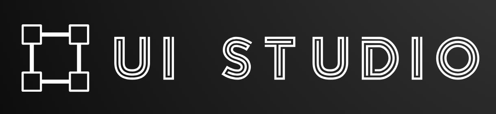

<div align="center">



**A real-time collaborative design canvas for the web.**

Open a board, share the URL, and design together — multiple people draw shapes, move objects, leave comments, and chat through their cursors, all synced live across every connected browser.

[](https://ui-studio-mu.vercel.app)
[](https://nextjs.org/)
[](https://www.typescriptlang.org/)
[](https://liveblocks.io/)
[](./LICENSE)

</div>

---

UI Studio is a multiplayer drawing and prototyping canvas. It is aimed at anyone who wants
a lightweight, no-login way to sketch ideas with other people in real time — designers,
developers, and teams running a quick whiteboard session.

> Built as a portfolio project and an open-source reference for real-time collaborative
> canvas applications using Liveblocks and Fabric.js.

## Try it

- **Live demo:** https://ui-studio-mu.vercel.app
- Click **Create New Board** to start a session, then share the board URL with anyone.
  Whoever opens the link joins the same canvas — no account needed.

## Screenshots

> _No screenshots are checked into the repo yet. Add images or a short GIF of the canvas
> in action here, or open the [live demo](https://ui-studio-mu.vercel.app) to see it._

## Features

### Real-time collaboration

| Feature | Description |
|---|---|
| **Multi-user canvas** | Draw and edit shapes simultaneously; every change syncs live through Liveblocks storage |
| **Live cursors** | See every connected user's cursor position, with per-user colors |
| **Active users** | Avatars in the navbar show who is currently in the room |
| **Cursor chat** | Press `/` to send an ephemeral message that follows your cursor |
| **Emoji reactions** | Press `E` to pick and broadcast floating emoji reactions |
| **Pinned comments** | Attach threaded comments to any point on the canvas (Liveblocks Comments) |
| **Collaborative history** | Shared undo / redo backed by Liveblocks |
| **Connection status** | Live indicator and on-canvas status bar showing sync state and object count |

### Drawing and editing

| Feature | Description |
|---|---|
| **Shape tools** | Rectangle, circle, triangle, line, and freeform (pen) drawing |
| **Text tool** | Add and edit inline text on the canvas |
| **Image import** | Upload images directly onto the canvas |
| **Pan & zoom** | Scroll to zoom (20%–400%); hold `Space` or use the Hand tool to pan; fit-to-screen |
| **Property inspector** | Position (X/Y), size (W/H), rotation, fill, stroke width, opacity, and rectangle corner radius |
| **Text properties** | Font family, size, and weight (text objects only) |
| **Color tools** | 12 preset swatches plus a screen eyedropper (uses the browser `EyeDropper` API where supported) |
| **Brush size** | Adjustable brush width (1–60px) for the freeform pen |
| **Layer panel** | List of all canvas objects; selection stays in sync with the canvas |
| **Object ordering** | Bring to front / send to back |
| **Multi-select alignment** | Align left / horizontal-center / right / top / vertical-center / bottom |
| **Duplicate** | Duplicate the active selection (`Cmd/Ctrl + D`) |
| **Resizable sidebars** | Drag to resize the left and right panels; layout persists across reloads |

### Export and import

| Feature | Description |
|---|---|
| **PNG export** | Export the canvas as a PNG image |
| **PDF export** | Export the canvas as a landscape PDF (via jsPDF) |
| **JSON export / import** | Save the board to a JSON file and re-import it (replaces the current board) |

### Sessions

| Feature | Description |
|---|---|
| **Multi-room** | Each board gets a unique URL; share the link to collaborate |
| **Onboarding** | First-visit guide for new users |
| **Mobile viewer** | On phones, a read-only viewer with pinch-zoom, drag-to-pan, fit-to-screen, and copy-link |

## Tech stack

| Layer | Technology |
|---|---|
| Framework | [Next.js 14](https://nextjs.org/) (App Router) |
| Language | [TypeScript](https://www.typescriptlang.org/) (strict mode) |
| Canvas | [Fabric.js v5](http://fabricjs.com/) |
| Real-time | [Liveblocks](https://liveblocks.io/) (presence, storage, comments) |
| Styling | [Tailwind CSS](https://tailwindcss.com/) |
| UI primitives | [Radix UI](https://www.radix-ui.com/) |
| Layout | [react-resizable-panels](https://github.com/bvaughn/react-resizable-panels) |
| Notifications | [Sonner](https://sonner.emilkowal.ski/) |
| Animation | [Framer Motion](https://www.framer.com/motion/) |
| PDF export | [jsPDF](https://github.com/parallax/jsPDF) |
| Icons | [Lucide React](https://lucide.dev/) |

## Run locally

### Prerequisites

- [Node.js 18+](https://nodejs.org/)
- [npm](https://www.npmjs.com/)
- A [Liveblocks](https://liveblocks.io/) account (the free tier is enough)

### 1. Clone and install

```bash
git clone https://github.com/zhenxiao-yu/ui-studio.git
cd ui-studio
npm install
```

### 2. Configure environment variables

The app needs a single environment variable — your Liveblocks **public** key.

```bash
cp .env.example .env.local
```

Then edit `.env.local`:

```env
NEXT_PUBLIC_LIVEBLOCKS_PUBLIC_KEY=pk_dev_your_key_here
```

Get a key from the [Liveblocks dashboard](https://liveblocks.io/dashboard): create a
project, then open **API keys** and copy the public key. Use a `pk_dev_` key for local
development. Without this variable the canvas loads but cannot connect, and a console error
explains what is missing.

> This key is a **public** key (it ships to the browser via the `NEXT_PUBLIC_` prefix).
> Do not commit `.env.local`, and do not use a Liveblocks secret key here.

### 3. Start the dev server

```bash
npm run dev
```

Open [http://localhost:3000](http://localhost:3000), click **Create New Board**, and share
the resulting URL to collaborate. Open the same URL in a second browser window to see live
sync, cursors, and presence.

## Scripts

These come straight from `package.json`:

| Script | What it does |
|---|---|
| `npm run dev` | Start the development server |
| `npm run build` | Production build |
| `npm run start` | Start the production server (after `build`) |
| `npm run lint` | Run ESLint (`next lint`) |
| `npm run typecheck` | Type-check with `tsc --noEmit` (no build output) |

## Keyboard shortcuts

### Tools

| Action | Shortcut |
|---|---|
| Select | `V` |
| Pan (Hand) | `H` (or hold `Space` and drag) |
| Rectangle | `R` |
| Circle | `O` |
| Line | `L` |
| Text | `T` |
| Pen / freeform | `P` |

### Editing

| Action | Shortcut |
|---|---|
| Copy | `Ctrl / ⌘ + C` |
| Paste | `Ctrl / ⌘ + V` |
| Cut | `Ctrl / ⌘ + X` |
| Duplicate | `Ctrl / ⌘ + D` |
| Undo | `Ctrl / ⌘ + Z` |
| Redo | `Ctrl / ⌘ + Y` |
| Delete selection | `Delete` / `Backspace` |

### View

| Action | Shortcut |
|---|---|
| Zoom in | `Ctrl / ⌘ + =` (or scroll) |
| Zoom out | `Ctrl / ⌘ + -` (or scroll) |
| Reset zoom (100%) | `Ctrl / ⌘ + 0` |
| Fit to screen | `Ctrl / ⌘ + 1` |

### Collaboration

| Action | Shortcut |
|---|---|
| Cursor chat | `/` |
| Emoji reactions | `E` |

Tool, edit, and view shortcuts are ignored while you are typing in an input field, so
they will not hijack the inspector or a comment composer.

## Architecture

```
app/
  page.tsx               # Home — creates a new board UUID and redirects
  layout.tsx             # Root layout: fonts, ErrorBoundary, Toaster
  App.tsx                # Thin shell: branches between desktop Editor and MobileViewer
  Room.tsx               # Liveblocks RoomProvider wrapper
  board/[roomId]/
    page.tsx             # Board route: wraps App in the Room provider

components/
  Editor.tsx             # Desktop editor body (navbar + sidebars + live canvas)
  MobileViewer.tsx       # Read-only canvas for phones (pinch-zoom, pan, fit, copy-link)
  Navbar.tsx             # Tool selector, active users, connection status
  LeftSidebar.tsx        # Layers panel (selection synced with canvas)
  RightSidebar.tsx       # Property inspector, ordering, alignment, duplicate, export
  Live.tsx               # Canvas interaction layer: cursors, reactions, comments
  ShapesMenu.tsx         # Shape tool picker
  Onboarding.tsx         # First-visit modal
  Loader.tsx             # Suspense fallback
  ErrorBoundary.tsx      # Catches and displays runtime errors
  comments/              # Liveblocks Comments UI
  cursor/                # Cursor rendering and cursor chat
  reaction/              # Flying emoji reactions
  settings/              # Color, dimensions, text, and export sub-panels
  users/                 # Active-user avatars
  ui/                    # Radix-based primitives (slider, toolbar, scroll area, etc.)

hooks/
  useFabricCanvas.ts     # Fabric lifecycle, tool/keyboard wiring, pan, duplicate, zoom
  useLiveStorage.ts      # Reads/writes the shared canvasObjects map
  useIsMobile.ts         # Viewport-based mobile detection (matchMedia)
  useInterval.ts         # Interval helper

lib/
  canvas.ts              # Fabric helpers: init, events, render, zoom, fit-to-screen
  shapes.ts              # Shape creation, modification, ordering, image upload
  key-events.ts          # Copy/paste/cut/delete + zoom keyboard handlers
  useMaxZIndex.ts        # Highest z-index helper (comment stacking)
  utils.ts               # cn(), random name generation, PNG/PDF export

liveblocks.config.ts     # Liveblocks client, room context, and shared types
constants/index.ts       # Nav elements, shape configs, shortcuts, colors
types/type.ts            # Shared TypeScript types
```

### Liveblocks types

```ts
Storage = {
  canvasObjects: LiveMap<string, FabricObjectJSON>   // objectId -> serialized Fabric object
}

Presence = {
  cursor: { x: number; y: number } | null
  cursorColor: string | null
  editingText: string | null
  message?: string
}

ThreadMetadata = {                                    // pinned comments
  resolved: boolean
  zIndex: number
  x: number
  y: number
  time?: number
}
```

## Deployment

### Vercel (recommended)

1. Push the repo to GitHub.
2. Import it in [Vercel](https://vercel.com/).
3. Add `NEXT_PUBLIC_LIVEBLOCKS_PUBLIC_KEY` under **Project Settings → Environment Variables**.
   Use a `pk_live_` key from the Liveblocks dashboard for production.
4. Deploy.

### Manual

```bash
npm run build
npm run start
```

## Status and known limitations

UI Studio is feature-complete for its core use case (real-time collaborative drawing) and
runs in production at the live demo above. Known constraints:

- **No authentication.** Users are anonymous and identified by random animal names per
  session. The room ID in the URL is the only access control — anyone with the link can
  join and edit.
- **Comment mentions are not wired to real accounts.** Liveblocks `resolveUsers` /
  `resolveMentionSuggestions` are stubs, so `@`-mentions have no user directory behind them.
- **Persistence depends on Liveblocks.** Board data lives in Liveblocks storage for as long
  as your project retains it (plan-dependent). There is no separate server-side save beyond
  Liveblocks and the manual JSON export.
- **Fabric.js v5.** The canvas uses the v5 API; it is not drop-in compatible with v6.
- **Mobile is view-only.** Phones get a read-only viewer (pinch-zoom, pan, fit-to-screen,
  copy-link); editing requires a desktop with mouse and keyboard.

## Roadmap

Ideas not yet implemented:

- [ ] Object-level canvas diffing (avoid full re-render on every storage update)
- [ ] SVG export
- [ ] User authentication and room access control
- [ ] Infinite canvas
- [ ] A test suite (Vitest + Playwright)

## Contributing

See [CONTRIBUTING.md](./CONTRIBUTING.md) for setup, the validation gate
(`lint` / `typecheck` / `build`), and commit conventions.

## Credits

Developed by [ZhenXiao (Mark) Yu](https://github.com/zhenxiao-yu).

Built on the Liveblocks, Fabric.js, and Next.js ecosystems.

## License

Released under the [MIT License](LICENSE).
